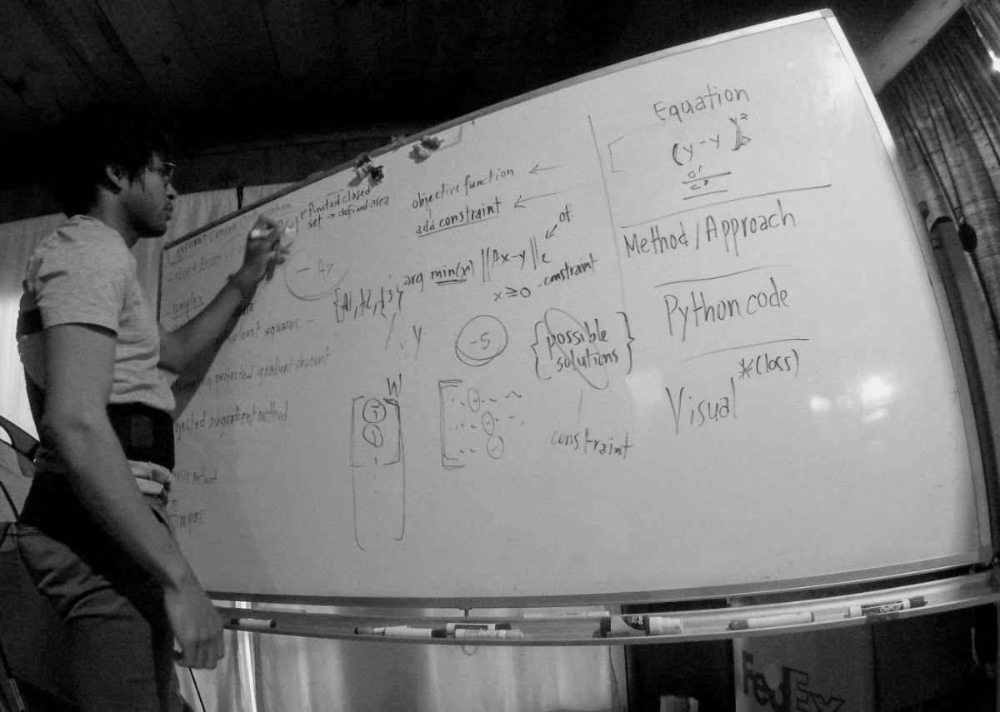
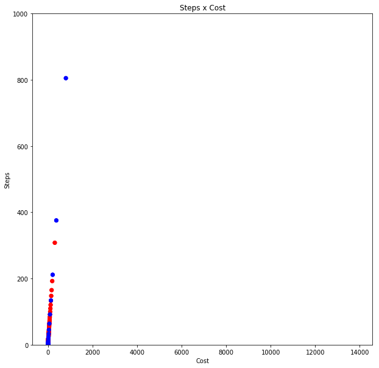
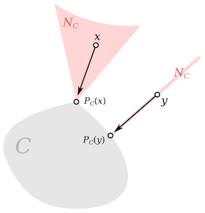
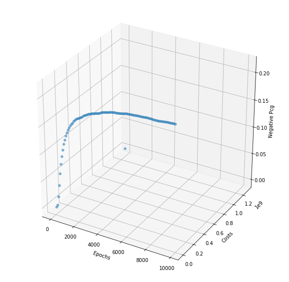
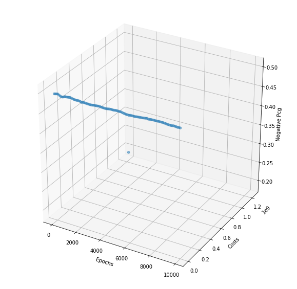
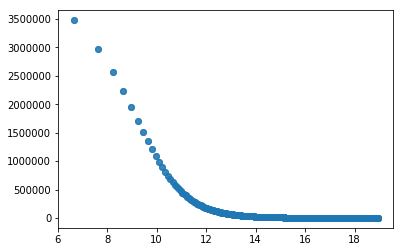

```{r}
library(reticulate)

```


*For OA*

# Problem Formulation



My first impression of the problem is that it should be simple to ensure all the weights (theta) are nonnegative but I wasn't quite sure how to ensure half or less of the parameters end up nonnegative, mainly because I didn't know which half of the parameters I should constrain. At that time, I was also not familiar with *projected* gradient descent under different constraints. But by the end of this exercise, I feel much more comfortable in dealing with these sort of constrained optimization problems. But I obviously have a long way to go on the topic.

I understand that I did not solve the problem in the hour allotted but I wanted to ensure that it is clear that I can solve a problem *on my feet* and as you can see [here](https://anthrochristianramsey.tumblr.com/search/algebra) and [here](https://anthrochristianramsey.tumblr.com/search/maths), I am continuously working on my mathematics for machine learning and is also why I've begun writing a mathematics [book](https://m4dl.com), titled, [Mathematics of Deep Learning](https://m4dl.com); as a way to solidify what I do know and extend myself where I don't.


Here, I will try to give you a quick outline of my background research on the matter to convey my understanding and the results to complete the problem with constraints


## Problem Formulation


Our typical case is the least squares case  which can be detonated as

$$f(x,\beta )=\sum _{{j=1}}^{m}\beta _{j}\phi _{j}(x),$$

in the linear case. This is straightfoward but what we'd like to do here is add a constraint that ensures that half of the parameters are nonnegative.
 $${Ax} -\mathbf {y} \|_{2}}$$ $$subject\ to\ x ≥ 0$$

Where 
We want to find the feasible set that fits our given constraints. 
- Constraints


We could change the objective function or add regularization but this would only resolve the issue **softly**. If we want half of the parameters to be constrained to be nonnegative, then we are dealing with a **hard** constraint so the projected method is one of the better approaches and is also the one requested.


# Background Research

The most basic idea I had was to use a similar method called non-negative least squares which I was only slightly familiar with. I am not currently well studied in operations research nor constrained convex optimization so I had to study up. Here are some of the topics I found myself reading in response to the task

- sub-gradient method
- quadratic programming
- nonnegative least squares
- projected gradient method
- alternating projected gradient method
- fast coordinate descent
- semidefinite programming
- interior points
- Karush–Kuhn–Tucker (KKT) conditions


# Steps

I will now walk through the steps I took to arrive at an early solution that meets our constraints. I went through a few steps to arrive at the implementation

1. NNLS
2. Projected sub-gradient
3. Alternating projected subgradient
4. Implementation with unique constraints


## Nonnegative least squares

$${\displaystyle \operatorname {arg\,min} \limits _{\mathbf {x} }\|\mathbf {Ax} -\mathbf {y} \|_{2}}$$ $$subject\ to\ x ≥ 0$$

Nonnegative least squares  (NNLS) is said to be equivalent to quadratic programming, it takes the least squares method and adds the constraint that every value in x (coefficients) needs to be nonnegative (x >= 0). 


$${\displaystyle \operatorname {arg\,min} \limits _{\mathbf {x\geq 0} }\left({\frac {1}{2}}\mathbf {x} ^{\mathsf {T}}\mathbf {Q} \mathbf {x} +\mathbf {c} ^{\mathsf {T}}\mathbf {x} \right),}$$


NNLS has been shown to be comprable to the LASSO method in regards to prediction without using explicit regularization.

Here is an implementation using projection to achieve nonnegative least squares.

```{python NNLS, echo=TRUE}


import numpy as np
X = np.random.rand(10,10)
y = X*2
n,m = X.shape
theta = np.random.normal(n, m, (n,m))
alpha = 0.005
bias = 2
half_obs = m*n/2
cost = 0

def input(X, y, iters):
    Xt = X.transpose()
    gd(Xt, y, theta, alpha, m, iters)
    
def gd(x, y, theta, alpha, m, iterations):
    xTrans = x.transpose()
    for i in range(0, iterations):
        y_hat = np.dot(x, theta)
        loss = y_hat - y
    
        cost = np.sum(loss ** 2) / (2 * m)
        if(i % 1000 == 0):
            print("Epoch %d - Cost: %f" % (i, cost))

# .     take the gradient    
        gradient = np.dot(xTrans, loss) / m
# .     update theta    
        theta = (theta - alpha * gradient)
#       project on to theta and truncate
        theta[theta < 0] = 0
    
    return theta    

input(X, y, 10000)

```




## Gradient Projection Methods




Gradient projection methods allow us to solve constrained optimization problems much quicker than alternative solutions. The projection methods enable us to make large changes to the working set at each iteration unlike other constrained methods that may only be able to impose one constraint per iteration. 

$$P[xk−α∇f(xk)],α≥0,$$

> The gradient projection method is guaranteed to identify the active set at a solution in a finite number of iterations. After it has identified the correct active set, the gradient-projection algorithm reduces to the steepest-descent algorithm on the subspace of free variables. As a result, this method is invariably used in conjunction with other methods with faster rates of convergence.


## Alternating projections method

$$f(x) = max\  (i=1,...,\ m)\ dist(x, Ci)$$

The projected subgradient method generally finds the point where 2 or more convex sets intersect (if they don't intercept then the method finds the hyperplane between the sets converging towards x* and y*). 

>They have been traced back to Neumann who said "where the alternating projection between two closed subspaces of a Hilbert space is guaranteed to globally converge to a intersection point of the two subspaces, if they intersect non-trivially*[8].

Much earlier work on this method showed linear convergence rates and have been further extended with updated versions (i.e. Dykstra's projection algorithm, fast projection algorithm, cyclic projection method). It also isn't the case that x, y need be convex as noted above and some guarnatees are still offered.

Here are the steps for projected gradient descent

1. Do a gradient update and ignore any of the constraints
2. Project the result back on the feasible set based on constrains
3. Replace/truncate entries

## Implementation with unique constraints

Here are the steps we'll use for our problem
1. Do a gradient update (ignore any of the constraints)
2. Project unto half of the result (back on the feasible set based on constrains)
3. Replace/Truncate entries down to zero


Remember that our constraint is to project on to the first 50% of components, check the boolean valued condition and replace those values with 0

$$theta ≤ 0, i = [1, . . . ,\ m/2] $$ 

So now we'll move into Python to solve the problem and plot the results

# Results











## Python Code

```{python Constrained Convex Opt, echo=TRUE}
import numpy as np

X = np.random.rand(100,100)
y = X*2
n,m = X.shape
theta = np.random.normal(n, m, (n,m))
alpha = 0.005
bias = 2
half_obs = m*n/2
cost = 0


def input(X, y, iterations, project):
    Xt = X.transpose()
    results = gd(Xt, y, theta, alpha, m, iterations, project)
#     return results

    
def gd(x, y, theta, alpha, m, iterations, project=False):
    xTrans = x.transpose()
    n,m = X.shape
    half_obs = int(m*n/2)
    cost = 0
    
    for i in range(0, iterations):
        y_hat = np.dot(x, theta)
        loss = y_hat - y
        
        cost = np.sum(loss ** 2) / (2 * m)

        # take gradient and update theta
        gradient = np.dot(xTrans, loss) / m
        theta = theta - alpha * gradient
        
        # project and truncate values
        
        theta[(theta < 0).nonzero()[0][:half_obs]] = 0
        
        
        if(i % 100 == 0):
            print("Iteration %f | Cost: %f" % (i, cost))
            
            pcg_negs =  (np.count_nonzero(theta[:half_obs]<0) / (m*n))             
#             print("Pcg of negatives %f" % (pcg_negs))     
            
            all_epochs.append(i)
            all_costs.append(cost)
            all_pcgs.append(pcg_negs)
            

        
    return({'theta': theta, 'cost' : cost})      


```


# Conclusions

It took quite a lot of research to find a rather simple technique but the early results after using projected gradient descent with the given constrained met the constraints without a significant increase in loss when low learning rates are used. It should be noted that the method is extremely slow as theta grows (1000x1000) but could be further optimized with a different projection approach that makes use of shortcuts via linear algebra but would require more time and understanding.

## Other Solutions
In the time allotted I was not able to follow through with many of the trajectories I would have liked to follow. Here would be some of my explorations.

1. Alternating projections on the HalfSpace
2. Use KKT to verify condition
3. Use bounded-variable least squares (BVLS)
4. Truncate with different values  replacement values (although the literature tells us anything from 0 to 1 should be insignificant) 
5. Try different sets to constrain
6. Plot contours to better explain method intuitively
7. Averaging over projections?

### Alternating Projections on the Half Space
1 Calculate gradient
2 Project into the HalfSpace with our constraints
3 Update theta


# References
- [Alternating Projections](https://web.stanford.edu/class/ee392o/alt_proj.pdf)
- 
- [Semidefinite Programming](https://web.stanford.edu/class/msande314/Introduction.pdf)

- [Positive Semidefinite Matrix](https://en.wikipedia.org/wiki/Positive-definite_matrix#Positive_semidefinite)

- [Projected Gradient Methods for Non-negative Matrix Factorization](https://www.csie.ntu.edu.tw/~cjlin/papers/pgradnmf.pdf)

- [Non-negative Least Squares](https://en.wikipedia.org/wiki/Non-negative_least_squares)

- [Karush–Kuhn–Tucker conditions](https://projecteuclid.org/euclid.bsmsp/1200500249)
- [Ground-motion prediction equations](https://peer.berkeley.edu/sites/default/files/webpeer-2011-102-john_douglas_-_published_jointly_by_brgm.pdf)

[Convergence Analysis of Alternating Nonconvex Projections](https://arxiv.org/pdf/1802.03889.pdf)

- [Functional operators - The geometry of orthogonal spaces](https://books.google.com/books/about/Functional_Operators.html?id=b3dOYQRBUk0C)

# Thank you