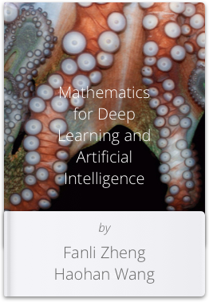
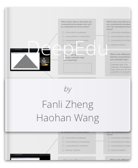

## [Fanli Zheng (Christian)](https://anthrochristianramsey.tumblr.com) & [Haohan Wang](https://www.tumblr.com/blog/haohanwang)

Deep Learning Researchers using machine learning in the fields of mental health, education, and design. 

[NLP, Physiology, Vision]

> I don't know why we are here, but I'm pretty sure that it is not in order to enjoy ourselves. - Wittgenstein

## 2018 Work (Finished and In Progress)

### [Mathematics for Deep Learning and AI (m4dl.com)](https://m4dl.com)

#### The mathematics needed for deep learning and ai. On it's way.

### [Applied Deep Learning with TensorFlow (Packt Publishing) course](https://github.com/dyadxmachina/Applied-Deep-Learning-with-TensorFlow)
#### 6+ hour course on deep learning using TensorFlow and Google Cloud Machine Learning Engine.

### [Deep Learning & Artificial Intelligence -
A human centered perspective](https://dyadxmachina.github.io/hub/intro_ai.html)

#### Yet another intro to deep learning and artificial intelligence

### [Emotion and AI on TensorFlow Meets @ Google #1](https://www.youtube.com/watch?v=9pr7j27G_TM)

### [Emotion and AI on TensorFlow Meets @ Google #2](https://www.youtube.com/watch?v=zqWrHaY6U9g)

#### Both of us on set with Laurence Moroney chatting about neuroscience, deep learning, and our latest course and research.

### [DeepEdu (Deep learning and education paper)](https://dyadxmachina.github.io/hub/deepedu.html)

#### How might we better represent and test a learner's formal knowledge?

### [huīsè de system](http://huisede.com)
#### a practical system for living in the age of entropy 

### [dyad language learning](https://github.com/dyadxmachina/dyad-language-learning)
#### How might one take best advantage of learning a language with a fluent speaker who is also your partner?

Email us at two@dyadxmachina.com or add us on LinkedIn [here](https://linkedin.com/in/christianramsey/) and [here](linkedin.com/in/haohanw/).